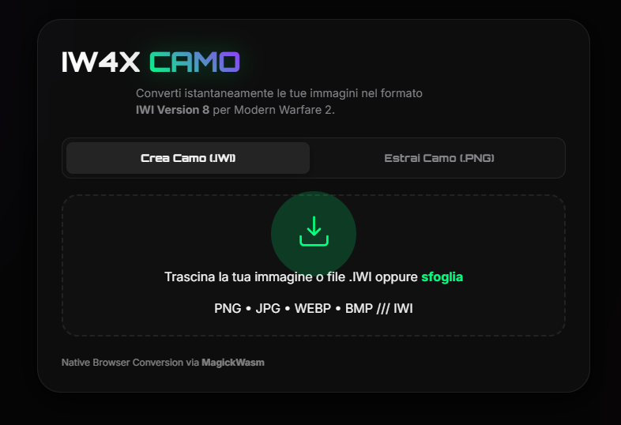

# IW4x Custom Camo Studio

Welcome to the ultimate tool for creating and extracting custom camouflages for Modern Warfare 2 (IW4x).

**[Launch Web App (GitHub Pages)](https://frank9615.github.io/iw4x-customcamos/)**



## Project Structure

Below is the folder organization of this repository:

- **`public/`**: 
  The core of the project. Contains the Web application (HTML/JS/CSS) that performs all `.png` -> `.iwi` conversions and the reverse `.iwi` -> `.png` extraction directly in your browser, leveraging *WebAssembly* (ImageMagick). 
  
- **`cli_tools/`**: 
  Command-line Python tools that allow you to manipulate or create `.iwi` and `.dds` files *offline*. Useful if you want to create auto-converting CI/CD scripts or if you prefer to operate via command line.

- **`test/`**: 
  Contains the testing environment (primarily Python scripts to resize images to 400x400 and test the menu mask in Black Ops 2 format) to then implement the winning logic into Javascript.

- **`iw_07/` and `other-camos/`**:
  Folders containing the original game `.iwi` and `.dds` files extracted from vanilla Call of Duty ISOs, essential as a bit-by-bit baseline and prototype assets.

## How to Run the Web App Locally

The web application is designed to be *client-side zero-knowledge* (no backend server or database required), but since it runs WebAssembly modules (ImageMagick WASM), it needs to be launched from a **local HTTP server** due to modern browsers' CORS policies.

If you don't want to use the [GitHub Pages Version](https://frank9615.github.io/iw4x-customcamos/), you have two simple options to run it locally:

### Method 1: VSCode (Recommended)
If you open this project using Visual Studio Code:
1. Install the **Live Server** extension.
2. Right-click on the `src/index.html` file.
3. Select **"Open with Live Server"**. The browser will magically open the suite.

### Method 2: Python HTTP Server (From Terminal)
If you already have Python installed and are in the native folder, go to the app directory and run:

```bash
cd public
python -m http.server 8000
```
Then open your favorite browser and go to **`http://localhost:8000`**.

Refer to the `CAMO_GUIDE.md` file for precise technical details on DXT1/DXT5 compression bits of the `IWi\x08` format.
