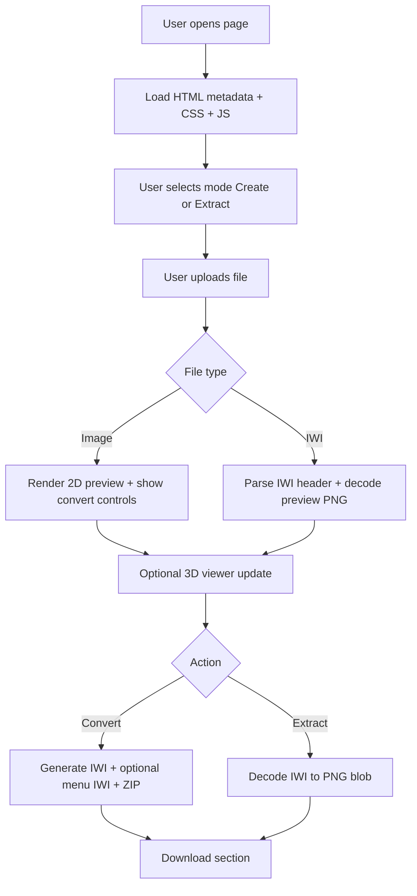

# IW4X Camo Studio - Code Architecture Guide

## 1) Overview

This document explains the current frontend architecture step by step.

The app has 3 main technical areas:

1. UI structure and metadata: `public/index.html`
2. Visual system and responsive layout: `public/styles.css`
3. Runtime logic and conversion pipeline: `public/app.js` and `public/viewer3d.js`

The workflow is browser-only (no backend):

- Input image -> convert to `.iwi`
- Input `.iwi` -> decode to `.png`
- Live 3D texture preview for both modes

---

## 2) High-Level Flow (Schema)



---

## 3) `index.html` Structure

### 3.1 Main sections

The page is organized in these blocks:

1. `<head>`
2. Main app card (`.glass-container`)
3. Live Armory panel (`#viewer-3d-wrapper`)
4. Image lightbox (`#image-lightbox`)
5. Module script (`app.js`)

### 3.2 App states in markup

Inside `.glass-container`, UI is state-driven with hidden/visible sections:

1. Upload state: `#drop-zone`
2. Preview state: `#preview-section`
3. Loading state: `#status-section`
4. Success/download state: `#download-section`
5. Error overlay: `#error-overlay`

Visibility is toggled by adding/removing `.hidden` from JS.

### 3.3 Metadata and SEO blocks

The `<head>` includes:

1. Standard SEO meta (title, description, canonical, robots)
2. Social meta (OpenGraph + Twitter)
3. Structured data JSON-LD (`WebApplication`)
4. Favicon + touch icon + web manifest
5. Google Analytics (`gtag.js`)

---

## 4) `styles.css` Architecture

### 4.1 Layering model

The stylesheet is split conceptually into layers:

1. Tokens (`:root`) and base reset
2. Global layout (`body`, `.glass-container`)
3. Functional components (drop zone, preview card, controls, result card)
4. Utility and overlays (`.hidden`, error overlay, image lightbox)
5. 3D viewer styles
6. Responsive breakpoints (`1100px`, `768px`)

### 4.2 Layout behavior

Core layout rules:

1. Base: centered content with flexible spacing
2. `body.viewer-active`: switches to 2-column grid when Live Armory is shown
3. Mobile breakpoints collapse back to single-column

Schema:

```text
Default:
[ Glass Container ]

Viewer Active:
[ Glass Container ][ 3D Viewer ]

Mobile:
[ Glass Container ]
[ 3D Viewer     ]
```

### 4.3 Preview card and lightbox

Preview behavior:

1. `.preview-card` has constrained max width for compact visual hierarchy
2. `#image-preview` is intentionally smaller (`max-height`) and clickable
3. `.image-lightbox` creates centered enlarged view with dark backdrop
4. Close actions: close button, click outside panel, Escape key

### 4.4 Dedup cleanup strategy applied

During cleanup, duplicated selector groups were consolidated:

1. Form layout selectors (`.options-group`, `.select-wrapper`, `.switches-container`)
2. Loader/presentation selectors (`.loader-container`, `.progress-container`, `.error-box`)

Important: final effective styles were preserved, only duplicates removed.

---

## 5) `app.js` Runtime Logic

### 5.1 Core responsibilities

`app.js` handles:

1. DOM state machine (upload/preview/loading/download/error)
2. Mode switching (Create/Extract)
3. File parsing and conversion orchestration
4. WASM bootstrapping (ImageMagick)
5. 3D viewer synchronization
6. Preview lightbox interactions

### 5.2 Runtime state variables

Main state variables:

1. `currentFile`: selected file
2. `outBlob` / `outFilename`: generated output asset
3. `initialized`: WASM initialization status
4. `viewerInitialized`: viewer bootstrap status
5. `currentPreviewObjectUrl`: revokable object URL for preview image
6. `currentIwiMeta`: parsed IWI header metadata

### 5.3 IWI extraction pipeline (step by step)

```text
1) Read .iwi ArrayBuffer
2) Parse first 32 bytes (IWi8 header)
3) Build DDS header + append texture payload
4) Decode DDS with ImageMagick WASM
5) Produce PNG blob
6) Update image preview + 3D texture + metadata panel
7) Enable PNG download state
```

### 5.4 Key helper functions

The JS was organized around reusable helpers:

1. `parseIwiHeader(arrayBuffer)`
   - Validates signature/version
   - Extracts flags, format, dimensions, mip offsets
2. `decodeIwiArrayBufferToPng(arrayBuffer, headerMeta)`
   - Converts IWI payload to DDS container
   - Uses WASM to decode into PNG blob
3. `applyDecodedIwiPreview(pngBlob, meta, sourceFilename)`
   - Single place to update output labels + preview + 3D texture
4. `setExtractDownloadState()`
   - Single place to switch download UI to PNG extraction state

This removes duplicated logic and reduces drift risk.

### 5.5 Create mode pipeline (step by step)

```text
1) Read source image
2) Draw to canvas (400x400 or max-res)
3) Optional menu canvas generation (crop/no-crop)
4) Optional watermark overlay on menu canvas
5) Encode canvases to PNG blobs
6) Convert PNG blobs -> DDS -> IWI bytes
7) Package outputs (single IWI or ZIP with menu IWI)
8) Update download section
```

### 5.6 UI state transitions

State transitions are deterministic:

1. Upload -> Preview after valid file
2. Preview -> Loading when conversion/extraction starts
3. Loading -> Download on success
4. Any state -> Error overlay on failure
5. Reset returns to Upload and clears transient resources

---

## 6) `viewer3d.js` Responsibilities

### 6.1 What this module does

1. Initializes Three.js scene/camera/renderer
2. Loads selected weapon model (or placeholder fallback)
3. Applies texture repeat strategy to mimic IW4x tiling
4. Exposes `updateCamoTexture(imageUrl)` to refresh materials
5. Manages studio controls (lighting/roughness/metalness/background/viewport)

### 6.2 Texture application strategy

Pipeline:

1. Load texture from URL
2. Traverse model meshes
3. Skip blocked mesh/material names (optic/lens/etc.)
4. Apply repeat/flip/color-space settings
5. Mark materials `needsUpdate`

---

## 7) Memory and Resource Safety

### 7.1 Object URL lifecycle

When previewing blobs, old object URLs are revoked before creating new ones.
This prevents memory leaks during repeated uploads.

### 7.2 Reset behavior

`resetUI()` clears:

1. Current file and output blobs
2. Parsed IWI metadata panel
3. Preview object URL
4. Viewer visibility class (`viewer-active`)
5. Lightbox state

---

## 8) Responsive Behavior

Breakpoints:

1. `max-width: 1100px`
   - Force single column even when viewer is active
2. `max-width: 768px`
   - Compact spacing, tighter preview, panel repositioning

Schema:

```text
Desktop wide:
[Converter Card | Live Armory]

Tablet/mobile:
[Converter Card]
[Live Armory  ]
```

---

## 9) Why this organization is safer

1. Duplicated selectors removed -> easier style predictability
2. Shared JS helper functions -> less copy/paste drift
3. Explicit UI state functions -> lower chance of broken transitions
4. Clear separation between conversion logic and rendering logic

---

## 10) Quick troubleshooting checklist

1. Preview not updating:
   - Check `currentPreviewObjectUrl` handling and `imagePreview.src`
2. Extract fails on IWI:
   - Verify header parse and supported format IDs (DXT1/DXT5)
3. Viewer appears but no texture:
   - Confirm `updateCamoTexture(...)` is called with valid URL
4. Layout issues in responsive:
   - Inspect `body.viewer-active` and breakpoint overrides

---

## 11) Suggested maintenance rules

1. Keep one selector definition per component whenever possible
2. Add new UI state changes through helper functions
3. Revoke object URLs after replacement
4. For new IWI formats, extend `formatMap` and decode path in one place
5. Keep metadata IDs stable; JS relies on them directly
